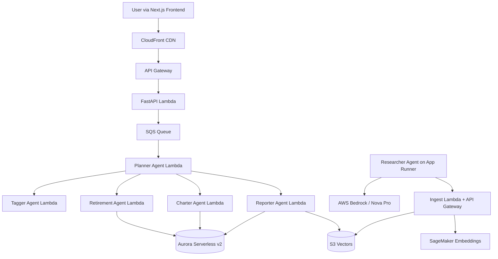

# Alex — Agentic Learning Equities eXplainer

<p align="center">
  <strong>A production-grade, multi-agent AI financial planning platform built on AWS and the OpenAI Agents SDK</strong><br/>
  Autonomous market research. Semantic retrieval. Real portfolio insights.
</p>

<p align="center">
  
  
  
  
  
  
  
  
  
  
  
  
</p>

<br/>

> _Viewing this in Cursor? Right-click the filename in the Explorer and select **"Open Preview"** for the full formatted experience._

# Week 3 Deployment Exercises
[Azure Deployment](https://cyber-analyzer.orangedesert-18550268.germanywestcentral.azurecontainerapps.io/)

[Google Cloud Deployment](https://cyber-analyzer-gb7cxbr2cq-uc.a.run.app/)

# Alex Repository
https://github.com/ebenhays/alex

## Table of Contents

1. [What Alex Does](#what-alex-does)
2. [Architecture](#architecture)
3. [Repository Structure](#repository-structure)
4. [Prerequisites](#prerequisites)
5. [Deployment Roadmap](#deployment-roadmap)
6. [Key Configuration Variables](#key-configuration-variables)
7. [Testing](#testing)
8. [Cost Management](#cost-management)
9. [Troubleshooting](#troubleshooting)
10. [Community & Support](#community--support)

---

## What Alex Does

Alex is a fully autonomous, multi-agent financial advisor platform that:

- Deploys **5 specialized AI agents** — Planner, Tagger, Reporter, Charter, and Retirement — each with a distinct role
- Conducts **live market research** via a browsing-capable agent running on AWS App Runner
- Converts research into **semantic vectors** stored cost-efficiently in S3 Vectors
- Delivers **portfolio reports, retirement projections, and chart visualizations** through a polished Next.js frontend
- Authenticates users with **Clerk** and isolates their data cleanly in Aurora Serverless v2

---

## Architecture



---

## Repository Structure

```
alex/
├── guides/              # Step-by-step deployment guides — start here
│   ├── 1_permissions.md
│   ├── 2_sagemaker.md
│   ├── 3_ingest.md
│   ├── 4_researcher.md
│   ├── 5_database.md
│   ├── 6_agents.md
│   ├── 7_frontend.md
│   └── 8_enterprise.md
│
├── backend/             # All agent and Lambda function code
│   ├── planner/         # Orchestrator — coordinates all sub-agents
│   ├── tagger/          # Classifies instruments in a portfolio
│   ├── reporter/        # Generates portfolio analysis reports
│   ├── charter/         # Builds data visualizations
│   ├── retirement/      # Projects retirement outcomes
│   ├── researcher/      # Autonomous web-research agent (App Runner)
│   ├── ingest/          # Document ingestion Lambda
│   ├── database/        # Shared database library
│   └── api/             # FastAPI backend serving the frontend
│
├── frontend/            # Next.js React application (Pages Router + Clerk)
│
├── terraform/           # Independent per-guide infrastructure modules
│   ├── 2_sagemaker/
│   ├── 3_ingestion/
│   ├── 4_researcher/
│   ├── 5_database/
│   ├── 6_agents/
│   ├── 7_frontend/
│   └── 8_enterprise/
│
└── scripts/             # Deployment helpers
    ├── deploy.py
    ├── run_local.py
    └── destroy.py
```

---

## Prerequisites
```bash
# Clone and set up environment
cp .env.example .env
# Fill in values as you progress through each guide
```

---

## Key Configuration Variables

These environment variables drive the researcher's behavior and can be tuned:

```env
BEDROCK_MODEL_ID=us.amazon.nova-pro-v1:0
BEDROCK_REGION=us-east-1

RESEARCHER_MCP_TIMEOUT_SECONDS=30
RESEARCHER_MAX_TURNS=14
RESEARCHER_REQUEST_TIMEOUT_SECONDS=75
```

**Tuning guidance:**
- Reduce timeouts for faster (shallower) responses
- Increase `MAX_TURNS` for deeper research at the cost of latency

> LiteLLM requires `AWS_REGION_NAME` — not `AWS_REGION` or `DEFAULT_AWS_REGION`. This trips people up often.

---

## Testing

Each agent has two test files:

```bash
# Local smoke test (uses mocked Lambdas)
MOCK_LAMBDAS=true uv run test_simple.py

# Full integration test against deployed AWS resources
uv run test_full.py
```

Other useful test commands:

```bash
# Test the researcher against a live query
cd backend/researcher
uv run test_research.py "semiconductor supply chain outlook 2025"

# Verify ingest and S3 vector search
cd backend/ingest
uv run test_search_s3vectors.py
```

---

## Cost Management

Alex uses serverless and pay-per-use components wherever possible, but **Aurora Serverless v2 is the largest cost driver** — destroy it when you're not actively working.

**Teardown order (reverse of deployment):**

```bash
cd terraform/4_researcher && terraform destroy
cd terraform/3_ingestion && terraform destroy
cd terraform/2_sagemaker && terraform destroy
```

Monitor your spend regularly in **AWS Cost Explorer** and keep budget alerts active.

---

## Troubleshooting

| Symptom | Likely Cause | Fix |
|---------|-------------|-----|
| `package_docker.py` fails | Docker Desktop not running | Start Docker, wait for full init, retry |
| Bedrock access denied | Model not enabled in your region | Enable Nova Pro in Bedrock console → Model access |
| Terraform apply fails | `terraform.tfvars` missing or incomplete | Copy from `.tfvars.example`, fill all values |
| Lambda 500 / timeout | Wrong package, missing env vars, IAM issue | Check CloudWatch logs, verify Lambda env vars |
| Aurora connection errors | Data API off, wrong ARNs, still initializing | Wait ~15 min, verify Data API is enabled, recheck ARNs |

---

> Alex is an educational project built as part of the **AI in Production** course by **Ed Donner** on Udemy.
> It is not financial advice — always do your own research before making investment decisions.
