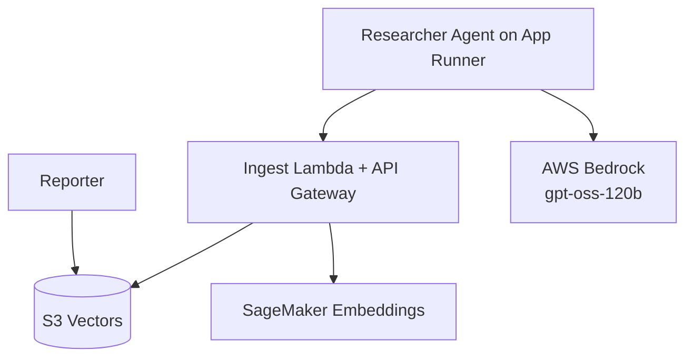

<div align="center">
  <h1> Alex - Agentic Learning Equities Explainer </h1>
</div>

<p align="center">
  <strong>Enterprise-grade, multi-agent financial planning SaaS built on AWS + OpenAI Agents SDK</strong><br/>
  Researches markets, ingests knowledge, analyzes portfolios, generates charts, and projects retirement outcomes.
</p>

<p align="center"> 
  
  
  
  
  
  
  
  
  
  
</p>

<br/>

## Architecture



<br/>

## Core Features

- Multi-agent orchestration with specialized responsibilities
- Autonomous market research + ingestion pipeline
- Cost-optimized vector search using S3 Vectors
- Structured portfolio/job persistence in Aurora Serverless v2
- Event-driven processing via SQS + Lambda
- Production-ready deployment using Terraform per-guide modules
- Cloud-native observability via CloudWatch/App Runner logs


<br/>

## Improvements Added in This Implementation

The following enhancements were added to make the researcher significantly more agentic and resilient:

<br/>

| Area | Improvement | Why It Matters |
|---|---|---|
| Context Engineering | Introduced `ResearchBrief` and `render_research_task` with explicit objective, guardrails, output sections, and quality checks | Better consistency and less drift in agent behavior |
| Agentic Planning | Added run-scoped to-do tools: `add_todo_item`, `complete_todo_item`, `get_todo_status` | Forces explicit plan/execute/verify loop |
| Source Discipline | Added `record_source` and `get_source_log` tools | Creates a traceable evidence ledger per run |
| Ingestion Safety | Added per-run ingestion guard (`ingestion_count`) to allow ingest once | Prevents duplicate writes and noisy vector store entries |
| Model/Region Config | Replaced hardcoded model/region with env + defaults (`gpt-oss-120b`, `us-west-2`) | Safer multi-env deployment and easier tuning |
| Terraform Runtime Env | Added `bedrock_model_id` + `bedrock_region` variables and App Runner env wiring | Infrastructure-driven model control |
| Deploy Script Hardening | Updated deploy pipeline to pass Bedrock env vars during App Runner update | Reduces config drift after redeploys |
| Timeout Resilience | Added bounded runtime controls (`RESEARCHER_MCP_TIMEOUT_SECONDS`, `RESEARCHER_MAX_TURNS`, `RESEARCHER_REQUEST_TIMEOUT_SECONDS`) | Prevents runaway runs and App Runner 504s |
| Fallback Path | Added automatic fallback agent run when MCP/turn/time limits fail | Endpoint returns useful output instead of failing hard |
| Prompt Guardrails | Explicitly disallowed unavailable browser tools (e.g. `browser_search`) and tightened source limits | Reduces tool mismatch errors and improves reliability |


<br/>

### Files Updated for These Improvements

- `backend/researcher/context.py`
- `backend/researcher/tools.py`
- `backend/researcher/server.py`
- `backend/researcher/deploy.py`
- `terraform/4_researcher/variables.tf`
- `terraform/4_researcher/main.tf`
- `terraform/4_researcher/terraform.tfvars.example`


<br/>

## Researcher Runtime Tuning

These env vars control reliability/latency behavior in `backend/researcher/server.py`:

```env
BEDROCK_MODEL_ID=openai.gpt-oss-120b-1:0
BEDROCK_REGION=us-west-2

RESEARCHER_MCP_TIMEOUT_SECONDS=30
RESEARCHER_MAX_TURNS=14
RESEARCHER_REQUEST_TIMEOUT_SECONDS=75
```

Tune recommendations:

- Lower values: faster responses, more fallback usage
- Higher values: deeper browsing, higher timeout risk


<br/>

## Roadmap Ideas

- Add Polygon MCP integration for market-price enrichment
- Add structured “fact table” extraction pipeline to external DB (e.g., Supabase)
- Add SQS retry wrappers around researcher-triggered ingestion
- Add evaluator/critic agent for report quality scoring
- Add user-facing citation cards sourced from `record_source` ledger

<br/>

## Application Source

The complete application is available at:
https://github.com/iJoshy/alex

See the README.md in the repository for detailed information about implementation, setup, and usage.


