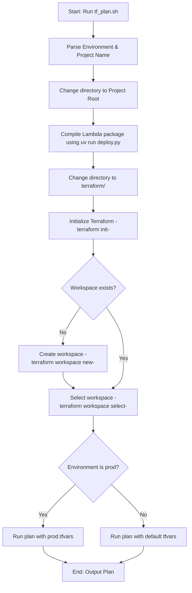

# Specification: Terraform Planning Automation (`tf_plan.sh`)

## 1. Overview

The `tf_plan.sh` script is an automated utility designed to generate Terraform execution plans for different deployment environments (`dev`, `test`, `prod`) in the Digital Twin project. It acts as a safety-first wrapper around the standard `terraform plan` workflow, ensuring all dependencies are compiled and the correct workspace contexts are set before any planning begins.

---

## 2. Key Benefits & Problems Solved

Running standard `terraform plan` manually in this project presents several issues that `tf_plan.sh` solves:

### A. Automatic Lambda Dependency Compilation
The Terraform configuration in `main.tf` defines the AWS Lambda resource with a direct dependency on a local ZIP package:
```hcl
source_code_hash = filebase64sha256("${path.module}/../backend/lambda-deployment.zip")
```
If a developer runs `terraform plan` before building this package, Terraform will exit with an error because the file does not exist. `tf_plan.sh` solves this by automatically executing the backend deployment packaging script (`deploy.py`) to compile the Lambda assets prior to running the plan.

### B. Prevention of Environment State Corruption
Terraform uses workspaces to isolate different environments (e.g., `dev` vs. `prod`). Running a plan in the wrong workspace can lead to state contamination or false plans. The script handles:
* Auto-detecting if the target workspace exists and creating it if necessary.
* Automatically selecting the target workspace before planning.

### C. Standardized Inputs and Flags
Depending on the environment, different variable files and flags must be supplied. The script automates this logic:
* Automatically injects `-var-file=prod.tfvars` only when targeting the `prod` environment.
* Injecting standard variables (`project_name` and `environment`) dynamically based on parameters.

---

## 3. Workflow Flowchart

The script processes steps in the following order:



---

## 4. Usage Guide

The script resides in the `scripts/` directory at the project root.

### Command Syntax
```bash
./scripts/tf_plan.sh [environment] [project_name]
```

### Examples
* **Default (Dev environment, "twin" project):**
  ```bash
  ./scripts/tf_plan.sh
  ```
* **Targeting Production:**
  ```bash
  ./scripts/tf_plan.sh prod
  ```
* **Targeting Test with custom project prefix:**
  ```bash
  ./scripts/tf_plan.sh test my-custom-twin
  ```

---

## 5. Implementation Example (`tf_plan.sh`)

Below is the complete implementation of the planning script:

```bash
#!/bin/bash
set -e

ENVIRONMENT=${1:-dev}          # dev | test | prod
PROJECT_NAME=${2:-twin}

echo "🔍 Generating Terraform plan for ${PROJECT_NAME} in ${ENVIRONMENT}..."

# 1. Build Lambda package (required so Terraform can compute the source code hash)
cd "$(dirname "$0")/.."        # project root
echo "📦 Building Lambda package..."
(cd backend && uv run deploy.py)

# 2. Switch to Terraform workspace & plan
cd terraform
terraform init -input=false

if ! terraform workspace list | grep -q "$ENVIRONMENT"; then
  terraform workspace new "$ENVIRONMENT"
else
  terraform workspace select "$ENVIRONMENT"
fi

# Use prod.tfvars for production environment
if [ "$ENVIRONMENT" = "prod" ]; then
  TF_PLAN_CMD=(terraform plan -var-file=prod.tfvars -var="project_name=$PROJECT_NAME" -var="environment=$ENVIRONMENT")
else
  TF_PLAN_CMD=(terraform plan -var="project_name=$PROJECT_NAME" -var="environment=$ENVIRONMENT")
fi

echo "🎯 Generating plan..."
"${TF_PLAN_CMD[@]}"
```

---

## Footer
* **Last updated at**: 2026-07-10
* **Last updated by**: Gemini 3.5 Flash
